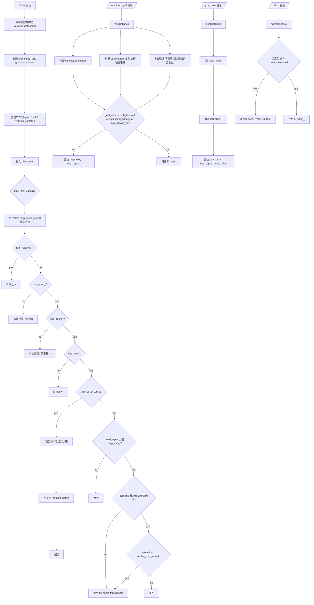
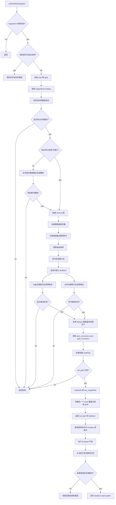
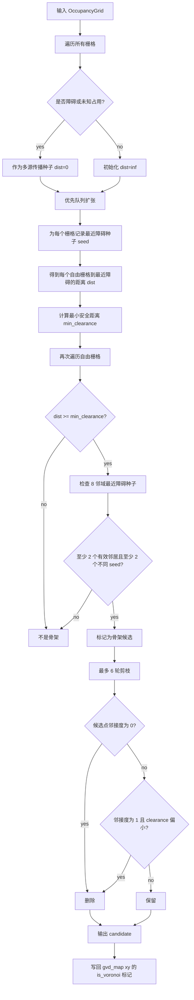

# nav2_voronoi_planner 

## 1. 定位

`nav2_voronoi_planner` 是一个独立的 ROS 2 Voronoi 路径规划节点包，不是标准 Nav2 `planner_server` 插件。

它的职责可以概括成两层：

- `VoronoiNode`
  - 负责 ROS 话题订阅、定时触发、重规划门控、结果发布。
- `VoronoiGridPlanner`
  - 负责把栅格地图转换成 Voronoi 骨架，并在骨架上搜索路径。

入口文件是 `src/voronoi_node_main.cpp`，最终只启动一个名为 `voronoi` 的节点。

## 2. 文件职责

- `src/voronoi_node.cpp`
  - 节点初始化、参数声明、订阅发布、重规划条件判断、路径发布。
- `src/voronoi_grid_planner.cpp`
  - 核心规划逻辑，包括障碍距离传播、骨架提取、连接段搜索、主干路径搜索、路径拼接。
- `src/voronoi_path_utils.cpp`
  - 栅格路径转 `nav_msgs/Path`、路径降采样、B-spline 平滑。
- `include/nav2_voronoi_planner/voronoi_types.hpp`
  - Voronoi 栅格基础数据结构，记录 `is_voronoi` 和 `dist`。
- `include/nav2_voronoi_planner/util.hpp`
  - 连续坐标与离散栅格坐标转换工具。

## 3. 输入输出关系

### 输入话题

- `/combined_grid`
  - 地图输入，类型 `nav_msgs/msg/OccupancyGrid`
- `/goal_pose`
  - 目标点输入，类型 `geometry_msgs/msg/PoseStamped`
- `/odom`
  - 机器人当前位姿，类型 `nav_msgs/msg/Odometry`

### 输出话题

- `/path`
  - 主输出路径，经过平滑处理
- `/path2`
  - 调试路径，是 `/path` 的再次降采样版本
- `/voronoi_skeleton`
  - 骨架可视化图，障碍为 `100`，Voronoi 骨架为 `0`，其他为 `-1`

## 4. 运行主线

### 4.1 节点启动阶段

节点启动后会：

1. 声明参数
2. 构造 `VoronoiGridPlanner`
3. 创建订阅器和发布器
4. 创建周期定时器 `plan_timer_`

关键参数包括：

- `robot_radius`
- `clearance_margin`
- `occ_threshold`
- `unknown_is_obstacle`
- `plan_period_ms`
- `replan_min_move`
- `stable_map_replan_period_ms`
- `map_significant_change_cells`
- `path_obstacle_check_distance_m`
- `path_switch_min_improvement_m`
- `connector_candidate_count`
- `enable_local_map_cropping`
- `local_crop_min_padding_m`
- `local_crop_detour_ratio`
- `local_crop_max_padding_m`
- `local_crop_expansion_factor`
- `local_crop_max_expansions`
- `path_smoothing_control_step`

### 4.2 三类回调的职责分工

#### 1. `mapCallback`

地图更新时不会立刻规划，只会判断是否需要重规划，并设置状态位：

- `significant_change`
  - 当前地图与上一帧地图相比，分类后的障碍状态变化格子数是否超过阈值
- `path_blocked`
  - 当前已发布路径在机器人前方一段距离内，是否已经撞到新障碍或超出地图
- `slow_replan_due`
  - 即使地图变化不大，也会每隔一段时间允许一次稳定地图重规划

只要以下任一条件满足，就会设置：

- `goal_dirty_ = true`
- `map_dirty_ = true`
- `need_replan_ = true`

#### 2. `goalCallback`

收到新目标后会：

- 保存最新目标 `last_goal_`
- 清空旧路径状态
- 标记 `goal_dirty_ = true`
- 标记 `need_replan_ = true`
- 标记 `map_dirty_ = true`

这意味着新目标会强制触发下一轮规划。

#### 3. `odomCallback`

里程计回调只做一件关键事：

- 判断机器人是否已经到达目标点

如果与目标距离小于 `goal_tolerance`，就会：

- 清除目标状态
- 清除重规划状态
- 发布空路径

### 4.3 定时器回调 `planTimerCallback`

定时器是整个节点真正的“规划调度入口”。

它每 `plan_period_ms` 毫秒触发一次，流程如下：

1. 从互斥锁保护的数据区复制地图、里程计、目标和状态快照
2. 如果没有地图，直接返回
3. 如果没有里程计，直接返回
4. 如果没有目标，直接返回
5. 如果已经到达目标，直接返回
6. 如果既不需要重规划，也没有地图脏标记，直接返回
7. 如果上次规划后机器人移动距离小于 `replan_min_move`，并且这次不是目标变化/地图变化触发，则跳过
8. 调用 `tryPlanWithSnapshot`

这里的设计重点是：

- 真正的规划发生在定时器线程中，而不是订阅回调线程里
- 订阅回调只负责“标记需要规划”
- 这样可以避免地图高频更新时在回调里直接做重计算

## 5. `tryPlanWithSnapshot` 的规划发布流程

这是 `VoronoiNode` 中最核心的函数。

### 5.1 规划前检查

它先做两步检查：

1. 地图和里程计快照是否存在
2. 当前机器人是否已经足够接近目标

如果已经到达目标，会直接发布空路径并退出。

### 5.2 调用底层规划器

然后构造：

- `start`
  - 来自 `/odom`
- `goal`
  - 来自 `/goal_pose`

再调用：

- `planner_->makePlanFromMap(...)`

输出两个结果：

- `plan`
  - 原始栅格路径转成的 `nav_msgs/Path`
- `skeleton`
  - 骨架调试图

### 5.3 平滑与抗振荡

规划成功后，不会立刻发布，而是先做两层后处理：

1. `downsamplePath`
  - 从原始路径抽取更稀疏的控制点，并保留首尾点
2. `smoothPathBSpline`
  - 对控制点做 clamped uniform B-spline 平滑，输出点数通常与原路径点数接近，且首尾点保持不变

然后它会把“新路径”和“当前已发布旧路径”进行比较：

- 如果旧路径没有被新地图堵住
- 并且这次不是新目标触发
- 并且新路径没有比旧路径剩余长度明显更短

那么它会保留旧路径，避免频繁切换路径导致振荡。

比较阈值由 `path_switch_min_improvement_m` 控制。

### 5.4 发布

最终会发布：

- `/voronoi_skeleton`
- `/path`
- `/path2`（如果开启调试）

并把 `last_published_plan_` 更新为新路径。

## 6. `makePlanFromMap` 的核心规划逻辑

`VoronoiGridPlanner::makePlanFromMap` 的内部步骤非常清晰，可以分成 8 段。

### 第 1 段：坐标转换

将连续世界坐标转为地图栅格坐标：

- `start.pose.position -> (start_x, start_y)`
- `goal.pose.position -> (goal_x, goal_y)`

### 第 2 段：边界与占用检查

如果起点或终点：

- 超出地图边界，则直接失败
- 落在障碍或未知区，则在一定半径内寻找最近自由栅格

其中：

- 起点搜索半径约为 `2 * robot_radius`
- 终点搜索半径约为 `3 * robot_radius`

### 第 3 段：局部代价地图裁剪与扩窗

当前实现会优先尝试“以起点和终点为核心”的局部地图裁剪：

- 先取起点和终点的最小包围框
- 再叠加安全外扩
  - 至少覆盖 `robot_radius + clearance_margin`
- 再叠加绕行冗余
  - 由 `local_crop_min_padding_m`
  - 和 `local_crop_detour_ratio * 起终点直线距离`
  - 两者取较大值后决定

如果第一次局部窗口规划失败，不会立刻结束，而是：

- 按 `local_crop_expansion_factor` 逐步扩大窗口
- 最多尝试 `local_crop_max_expansions + 1` 次局部规划
- 如果局部窗口已经扩展到全图，或者局部尝试全部失败，则自动回退到全图规划

这个阶段的目标，是尽量把 Voronoi 距离场和骨架提取限制在与当前任务相关的局部范围里，从而降低单次重规划耗时。

### 第 4 段：构建 Voronoi 图

调用 `buildVoronoiDiagramFromOccupancyGrid`，输出一张 `gvd_map`：

- `dist`
  - 每个栅格到最近障碍的米制距离
- `is_voronoi`
  - 是否属于骨架点

这一段内部会经历“障碍种子扩散 -> 距离场计算 -> 骨架候选提取 -> 剪枝”几个步骤，后面第 7 节会单独展开，不在这里重复。

### 第 5 段：为起终点寻找骨架连接候选

调用 `findReachableVoronoiCandidates` 两次：

- 一次从起点出发
- 一次从终点出发

这个搜索本质上是带安全约束的 Dijkstra：

- 只能走自由栅格
- 栅格 clearance 必须大于 `max(robot_radius + clearance_margin, 1.5 * resolution)`
- 对角走法还要检查防止“切角穿障碍”

它会返回一组候选：

- `point`
  - 可连接到的 Voronoi 骨架点
- `connector_path`
  - 从起点/终点到该骨架点的局部连接段
- `connector_cost`
  - 连接代价

### 第 6 段：搜索全局最优骨架主干

调用 `searchBestVoronoiRoute`：

1. 把所有起点候选同时压入优先队列
2. 在 Voronoi 骨架上做一次多源 Dijkstra
3. 只要搜索到任一终点候选，就计算：

`总成本 = 起点连接段成本 + 骨架主干成本 + 终点连接段成本`

4. 选择总成本最小的组合

最后得到三段路径：

- `start_connector`
- `trunk_path`
- `goal_connector`

### 第 7 段：拼接完整栅格路径

用 `appendPathNoDuplicate` 依次拼接三段路径，避免重复点：

- 起点连接段
- Voronoi 主干段
- 终点连接段

### 第 8 段：转成 ROS Path

调用 `PopulateGridPath`，把栅格路径转换成 `nav_msgs/Path`。

转换时会：

- 把栅格中心点转为世界坐标
- 用前后点方向估算每个 pose 的航向

最后还会把终点 pose 强制覆盖成原始 `goal` 消息。

## 7. Voronoi 骨架生成

这一段对应的核心实现是 `buildVoronoiDiagramFromOccupancyGrid()`，位置在 [voronoi_grid_planner.cpp](/home/xu/project/auto_nav2/src/nav2_voronoi_planner/src/voronoi_grid_planner.cpp:656)。

如果只记一句话，可以这样理解：

“Voronoi 骨架是在自由空间里，找到既离障碍足够远、又处在不同障碍影响面分界处的那条中轴线。”

### 7.1 先建立一个直觉

假设地图里有一条走廊：

```text
########........########
########........########
########........########
```

如果把左右两侧障碍都看成“向外扩张”的影响源，那么：

- 靠近左墙的格子，会被左墙主导
- 靠近右墙的格子，会被右墙主导
- 中间那一带，会成为左右两侧影响的分界带

Voronoi 骨架要找的，就是这条分界带中连通且安全的中线。

### 7.2 先看这 4 个关键结果

这个函数内部最值得抓住的是 4 个量：

- `dist_map`
  - 每个格子到最近障碍的距离，先以格子为单位计算
- `seed_map`
  - 每个格子最近的障碍源是谁
- `candidate`
  - 哪些格子被初步判断为骨架候选
- `gvd_map`
  - 最终输出，里面保存米制距离 `dist` 和骨架标记 `is_voronoi`

只要把这 4 个量对应起来，整段代码就会顺很多。

### 7.3 算法流程

#### 第一步：把所有障碍格当成传播种子

代码先扫描整张地图，把所有障碍格压入优先队列，见 [voronoi_grid_planner.cpp](/home/xu/project/auto_nav2/src/nav2_voronoi_planner/src/voronoi_grid_planner.cpp:699)。

对于障碍格本身：

- `dist_map[x][y] = 0`
- `seed_map[x][y] = {x, y}`

意思很直接：

- 障碍到自己的距离是 0
- 它自己就是距离传播的源头

#### 第二步：做多源传播，得到障碍距离场

接着代码从优先队列里不断取出当前代价最小的点，并向 8 邻域扩展，见 [voronoi_grid_planner.cpp](/home/xu/project/auto_nav2/src/nav2_voronoi_planner/src/voronoi_grid_planner.cpp:715)。

最关键的一行是：

```cpp
const double nd = std::hypot(
  static_cast<double>(nx - cur.seed_x),
  static_cast<double>(ny - cur.seed_y));
```

它不是简单地“在当前路径长度上再加一步”，而是直接计算邻居格到原始障碍种子的欧氏距离。  
所以传播结束后，每个自由格都会知道两件事：

- 自己最近的障碍源是谁
- 自己离最近障碍有多远

你可以把这一步理解成：障碍像墨水一样向外扩散，每个自由格最终都被最近的那团“墨水”染色。

#### 第三步：把距离换成米，并先做安全过滤

传播时得到的距离还是格子单位，随后代码会乘以地图分辨率，写入 `gvd_map[x][y].dist`，见 [voronoi_grid_planner.cpp](/home/xu/project/auto_nav2/src/nav2_voronoi_planner/src/voronoi_grid_planner.cpp:743)。

然后它计算一个最低安全间隙：

```cpp
min_clearance = max(robot_radius + clearance_margin, 1.5 * resolution)
```

这一步的含义是：

- 如果一个自由格离障碍太近
- 哪怕它位于几何上的中间位置
- 也不能进入骨架候选集合

所以这里提取的不是“纯数学中轴”，而是“考虑机器人尺寸后的安全中轴”。

#### 第四步：找出不同障碍影响面的分界点

这是骨架提取最核心的一步，见 [voronoi_grid_planner.cpp](/home/xu/project/auto_nav2/src/nav2_voronoi_planner/src/voronoi_grid_planner.cpp:755) 到 [voronoi_grid_planner.cpp](/home/xu/project/auto_nav2/src/nav2_voronoi_planner/src/voronoi_grid_planner.cpp:796)。

对每一个自由且满足安全距离的格子，代码检查它的 8 邻域，并统计：

- `valid_neighbors`
  - 周围有多少个邻居本身也是自由且安全的
- `different_seed_neighbors`
  - 这些邻居里，有多少个邻居的最近障碍源与当前点不同

判定条件是：

```cpp
if (valid_neighbors >= 2 && different_seed_neighbors >= 2) {
  candidate[x][y] = 1;
}
```

这句可以直接翻成：

- 当前点不能是孤点
- 并且它周围要能看到不同障碍势力范围的交界

为什么这就接近中轴？因为 `seed_map` 记录的是“谁离我最近”。  
当某个位置附近同时出现不同 seed 的交汇时，说明它正处于多个障碍影响面的边界附近，而这个边界正是离散 Voronoi 骨架的来源。

#### 第五步：剪枝，去掉毛刺和短小分支

仅靠 seed 分界提取出来的候选骨架，通常会包含毛刺、孤点和很短的小分支。  
所以代码又做了最多 6 轮剪枝，见 [voronoi_grid_planner.cpp](/home/xu/project/auto_nav2/src/nav2_voronoi_planner/src/voronoi_grid_planner.cpp:800)。

每轮会删除两类点：

- `degree == 0`
  - 完全孤立，没有候选邻居
- `degree == 1 && dist < min_clearance + 2 * resolution`
  - 只有一个邻居，像短毛刺，而且 clearance 也不够大

这一步可以理解成：先粗提一张骨架网，再不断削掉边缘噪声和不稳定末端。

#### 第六步：写回正式结果

剪枝完成后，代码把 `candidate[x][y]` 写回 `gvd_map[x][y].is_voronoi`，见 [voronoi_grid_planner.cpp](/home/xu/project/auto_nav2/src/nav2_voronoi_planner/src/voronoi_grid_planner.cpp:841)。

到这里，Voronoi 骨架就真正生成好了。后续规划阶段只需要继续使用：

- `gvd_map[x][y].dist`
- `gvd_map[x][y].is_voronoi`

### 7.4 用一张小示意图理解 `seed_map`

你可以把传播后的自由空间想成这样一张“归属分区图”：

```text
LLLLLLLLLMMMMMRRRRRRRRR
LLLLLLLLLMMMMMRRRRRRRRR
LLLLLLLLLMMMMMRRRRRRRRR
```

其中：

- `L` 表示最近障碍来自左边
- `R` 表示最近障碍来自右边
- `M` 表示处于两种影响交界附近

代码真正想找的，就是 `L` 和 `R` 交界带中最连通、最安全的那部分。

### 7.5 为什么这个骨架适合导航

它适合导航，主要因为两点：

- 它来自障碍距离场，所以天然偏向通道中间
- 它把“整张栅格搜索”压缩成“先接入骨架，再沿骨架搜索”

所以这个包的整体思路其实就是：

- 局部连接段负责把起点和终点接到骨架上
- 骨架主干负责给出更稳健的全局走廊

### 7.6 这份实现的局限

虽然工程上很好用，但它不是严格意义上的连续 Voronoi 图：

- 它是栅格近似，结果受地图分辨率影响
- 8 邻域规则会让骨架在拐角和窄缝处比较粗糙
- 剪枝规则是经验式，不保证最优拓扑结构
- 地图噪声越大，骨架越容易出现毛刺

## 8. 关键状态机理解

可以把节点内部状态理解成以下几个开关：

- `has_map_`
  - 是否收到地图
- `has_odom_`
  - 是否收到里程计
- `has_goal_`
  - 是否存在有效目标
- `goal_dirty_`
  - 目标是否发生变化，必须重新规划
- `map_dirty_`
  - 地图是否发生变化，规划结果可能失效
- `need_replan_`
  - 是否需要在定时器回调里触发一次规划
- `goal_reached_`
  - 是否已经到达目标
- `has_published_plan_`
  - 是否已经发布过路径

这些状态位共同实现了“回调只打标记、定时器集中规划”的工作模式。

## 9. 值得注意的实现细节

### 9.1 真正生效的主干代价是“长度优先”

虽然参数里有 `trunk_safety_penalty_scale`，而且 `searchVoronoiOnly` 里也实现了基于 clearance 的安全惩罚，但当前主流程并没有调用 `searchVoronoiOnly`。

真正被 `makePlanFromMap` 调用的是 `searchBestVoronoiRoute`，它在骨架主干上使用的是纯距离代价，没有把 clearance 惩罚加入总代价。

这意味着：

- 当前主干路径更偏向“最短骨架路”
- `trunk_safety_penalty_scale` 对实际主流程几乎没有效果

### 9.2 有几段辅助函数目前没有接入主流程

当前未进入实际主链路的函数包括：

- `lineOfSightFree`
- `makeLineGridPath`
- `findNearestReachableVoronoiPoint`
- `searchVoronoiOnly`

这说明作者可能为后续“直连 shortcut”“单一骨架搜索”“安全代价搜索”预留了接口，但现在没有用上。

### 9.3 平滑后没有再次做碰撞校验

原始栅格路径是安全的，但 B-spline 平滑后：

- 没有重新检查新轨迹是否进入障碍
- 没有再次检查 clearance 是否足够

因此在窄通道或尖角环境里，平滑路径可能比原始骨架路径更容易切角。

### 9.4 终点若被调整，最终发布终点仍会回到原始目标

如果原始目标点落在障碍或未知区域，代码会先找到一个最近自由栅格作为规划终点。

但在生成 `plan` 后，最后一个 pose 又会被强制改回原始 `goal`。

这意味着：

- 规划搜索阶段走的是“调整后的安全终点”
- 发布给控制器的最终终点却可能仍在障碍/未知区域

这一点在实际导航中需要特别留意。

## 10. 详细流程图

### 10.1 ROS 调度与重规划总流程



### 10.2 单次规划内部流程



### 10.3 Voronoi 骨架构建细流程



## 11. 总结

这个包的真实工作模式是：

“地图、目标、里程计回调只负责更新状态并请求重规划；定时器统一触发规划；规划器先在栅格地图中提取 Voronoi 骨架，再把起点和终点接到骨架上，搜索一条骨架主干，最后做平滑并带抗振荡策略发布路径。”
